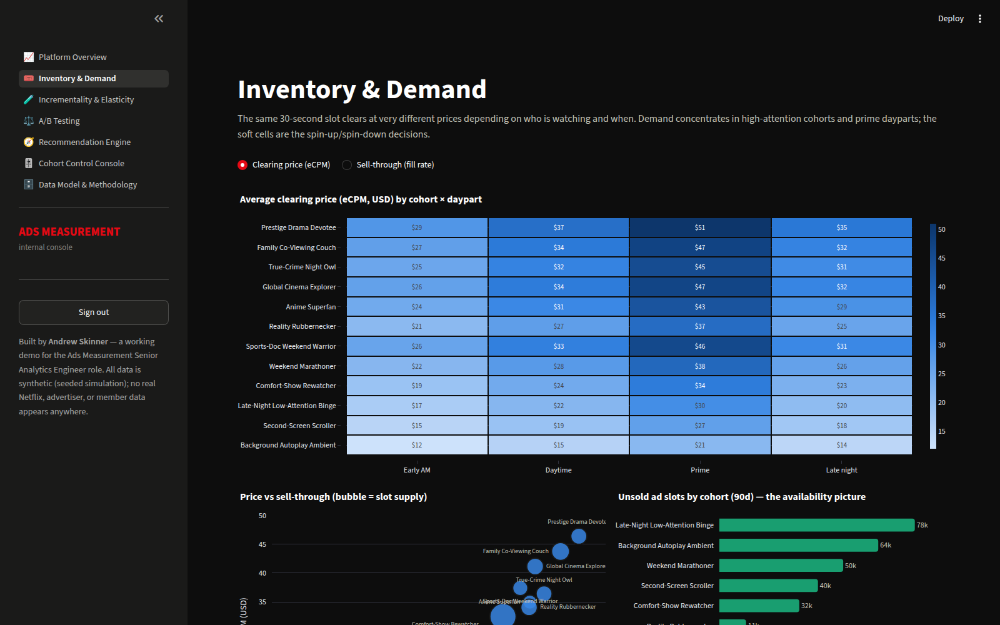
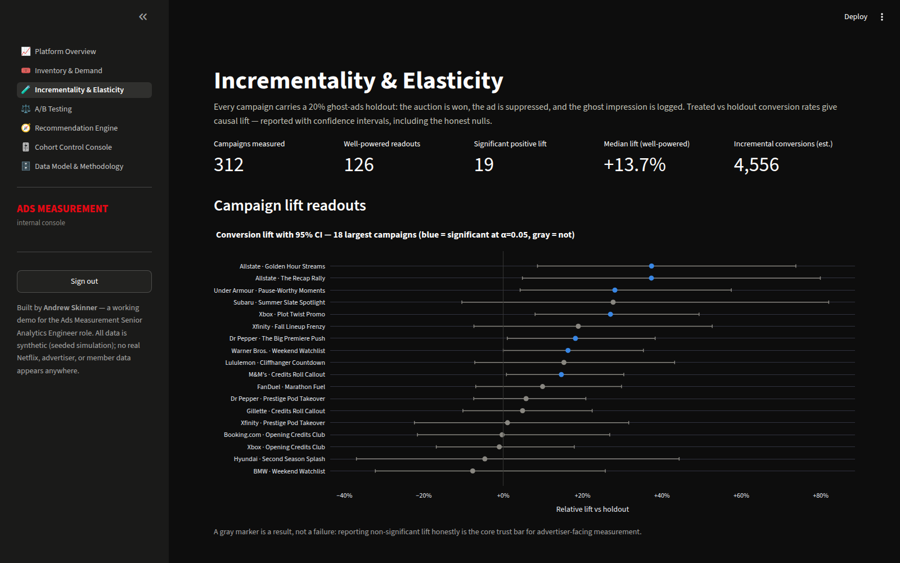

# Ads Measurement Console

An interactive, auth-gated measurement dashboard in the spirit of the Netflix Ads
Measurement team's charter: **trustworthy, transparent advertising measurement** —
built end-to-end with SQL (DuckDB), Python, and Streamlit on a fully synthetic,
seeded warehouse of ~1M ad placements.

Built by **Andrew Skinner** as a working demo for the Ads Measurement Senior
Analytics Engineer (Analytics Engineer 5 — Ads Measurement DSE) role. All data
is simulated; no real Netflix, advertiser, or member data appears anywhere.



## What it demonstrates

| Concept | Where |
|---|---|
| **Not all inventory is equally sought after** — sell-through and clearing price vary 4× across 12 behavioral session cohorts × dayparts | Inventory & Demand |
| **Incrementality** — ghost-ads holdout (20%) per account × campaign; lift with 95% CIs (delta method), Bayesian posteriors (Jeffreys), honest nulls included | Incrementality & Elasticity |
| **Elasticity** — incremental conversion rate by exposure frequency, fit to a saturating curve; half-saturation frequency drives budget advice | Incrementality & Elasticity |
| **A/B testing** — 30 account-split creative tests, plus a meta-experiment quantifying how much last-touch attribution overstates vs holdout truth | A/B Testing |
| **Recommendation engine** — inventory→advertiser matching, budget reallocation, creative-type guidance, platform spin-up/spin-down calls | Recommendation Engine |
| **Codified AI-for-BI** — natural-language question → semantic layer routes to one of a fixed menu of approved analyses and selects only pre-validated parameters → vetted SQL/Python runs → LLM summarizes the numbers. The model never writes SQL. | AI Analyst |
| **Spin up / spin down inventory per cohort** — a what-if console over a stated supply/demand equilibrium model | Cohort Control Console |
| **Estimator auditability** — the simulator plants ground truth, so measured lift is scored against known truth (CI coverage, MAE) | Data Model & Methodology |



## Data model

Nine warehouse tables built by a seeded generator (`src/datagen/generate.py`,
seed 42, ~6s): `dim_advertiser` (20 real brands across 12 categories), `dim_campaign`,
`dim_creative` (+ `dim_creative_type`: awareness / direct response /
click-to-learn-more), `dim_cohort` (12 cutesy-but-plausible session cohorts),
`dim_account` (anonymized, household-linked — no PII), `fact_session` (220k),
`fact_placement` (~1M auctions with ghost-holdout flags), `fact_positive_action`
(advertiser-reported conversions), `dim_ab_test`, plus `sim_*` tables holding the
planted ground truth used for calibration.

All core metrics run as reviewable SQL in [`sql/`](sql/) — every page has a
"View the SQL" expander.

## Run it

```bash
pip install -r requirements.txt
streamlit run streamlit_app.py
```

First boot generates the DuckDB warehouse (~20s), then everything is cached.

**Auth:** the app is gated by a username/password. No password is stored in the
repo — credentials are **required** from Streamlit secrets, and sign-in is
disabled until they're set. Copy `.streamlit/secrets.toml.example` to
`.streamlit/secrets.toml` (or paste into the Streamlit Cloud Secrets UI) with
`AUTH_USERNAME` and `AUTH_PASSWORD_SHA256` (a SHA-256 hash of your password).

**AI Analyst (optional LLM):** the **AI Analyst** page uses OpenAI for the
semantic-layer routing and the summary. Add `OPENAI_API_KEY` (and optionally
`OPENAI_MODEL`, default `gpt-4o-mini`) to your secrets to enable it. Without a
key the page still runs end-to-end on a deterministic keyword router and a
templated summary, with a banner saying so — the approved analyses in between
are identical either way. The LLM only picks an approved analysis and its
parameters and writes prose; it never generates SQL or Python.

## Deploy (Streamlit Community Cloud)

1. Push this repo to GitHub.
2. At [share.streamlit.io](https://share.streamlit.io) → New app → pick this
   repo/branch, main file `streamlit_app.py`.
3. Add secrets (`AUTH_USERNAME`, `AUTH_PASSWORD_SHA256`) to enable the login.
4. Share the URL + credentials.

## Honest limitations

- Volumes reflect a ~25k-account sample, not platform scale; rates, prices, and
  lift structure are the realistic part.
- Conversion matching is modeled as account-level joins; production would be a
  clean-room integration with match-rate calibration.
- The cohort simulator's elasticities are stylized constants, stated in the UI;
  production values would come from staged regional ad-load experiments.
